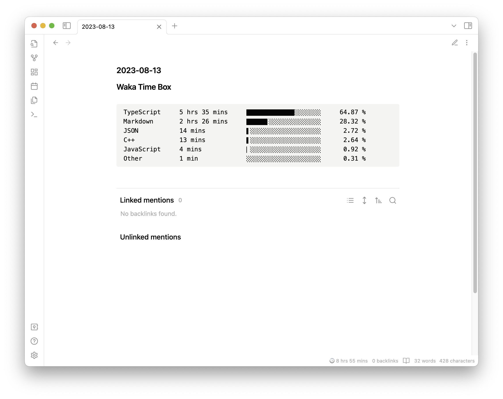
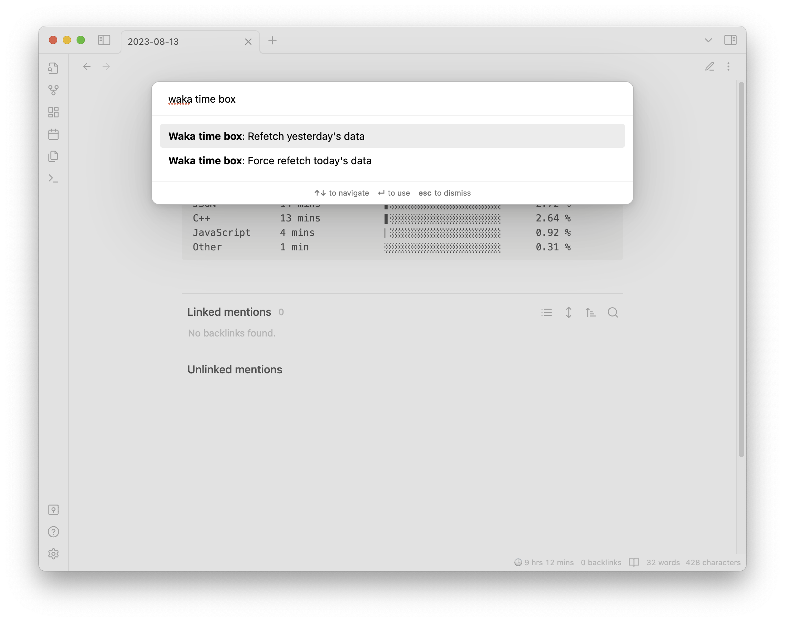

# Obsidian WakaTime Box

This plugin will fetch your [WakaTime](https://wakatime.com/) stats and display them in your Obsidian daily notes

By default, it will fetch periodically every hour, but you can force a refresh from the command palette

This plugin will insert the stats at the top of the daily note. But if it's existing, it will refresh the stats instead of inserting a new one. You can use this behavior to customize where to insert the stats in your daily note.
